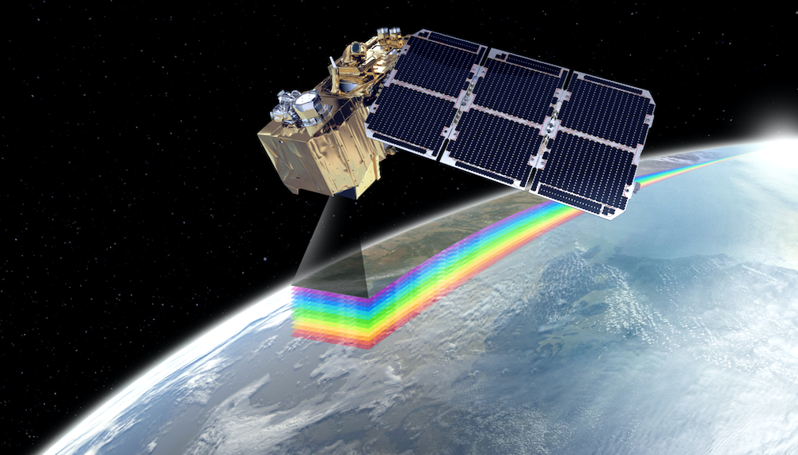
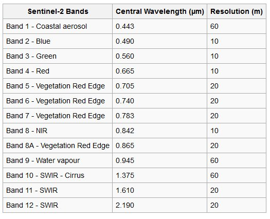
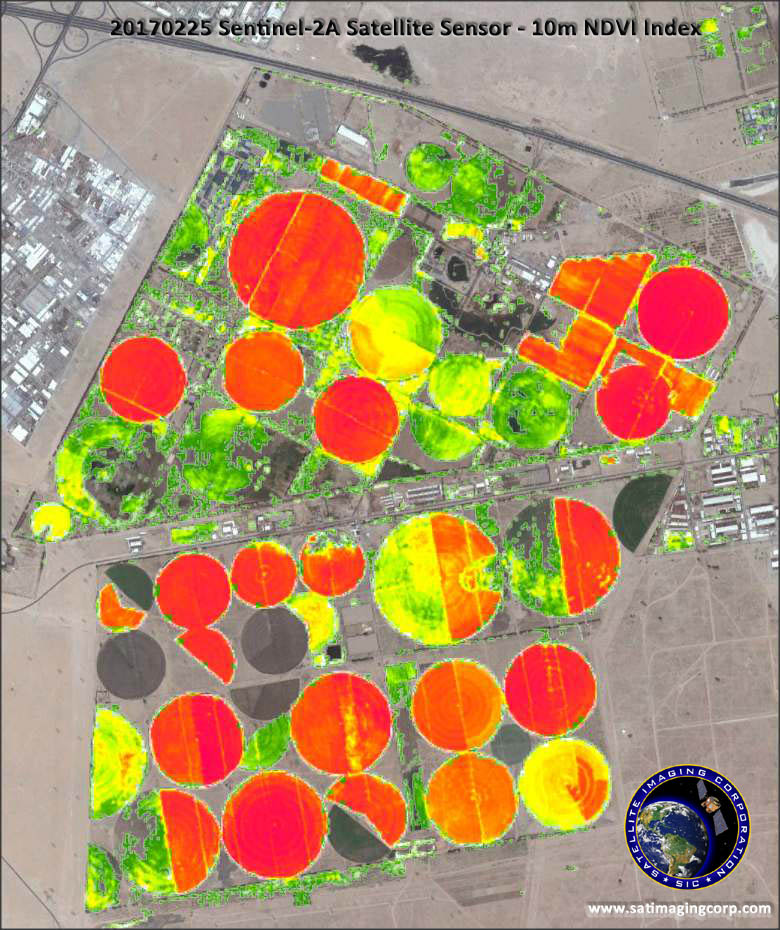
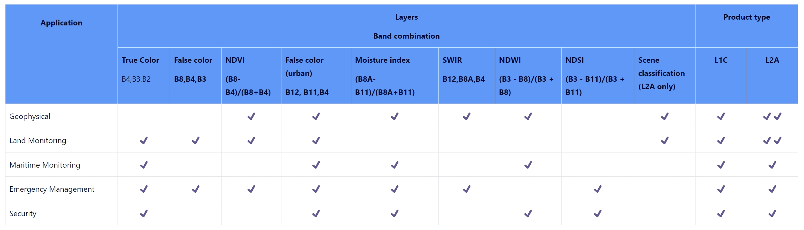

## Summary
### Sentinel-2A

.pull-left[

  

]

.pull-right[

Sentinel-2A is part of the Copernicus Programme, which is a cornerstone of Europe's Earth observation efforts. The Sentinel-2A satellite was launched on June 23, 2015, and it works in tandem with its twin, Sentinel-2B, to provide high-resolution optical imagery for land monitoring.

]

---
## Summary

### Key features and capabilities

* Multi-Spectral Imaging: Sentinel-2A is equipped with a multi-spectral imager that can capture data in 13 spectral bands.

* High Resolution: The satellite provides images with a high spatial resolution of 10, 20, or 60 meters, depending on the spectral band.

* Frequent Revisits: The Sentinel-2 mission (combining 2A and 2B) provides frequent revisit times, with the same area being covered every five days at the equator.

* Coverage: all continental land surfaces (including inland waters) between latitudes 56° South and 82.8° North, all coastal waters up to 20 km from the shore, all islands greater than 100 km2, all EU islands, the Mediterranean Sea, all closed seas (e.g. Caspian Sea).

---

## Summary

### Available Bands and Data

 
  Source: <a
  href="https://www.satimagingcorp.com/satellite-sensors/other-satellite-sensors/sentinel-2a/"
  style="color: #7910FF;">Sentinel-2A (10m) Satellite Sensor</a> 

  

---

## Summary

### Band Combinations

The false colour composite: B8, B4, B3. Plants reflect near-infrared and green light whilst absorbing red.

Atmospheric penetration composite: B12, B11, B8A with no visible bands to penetrate atmospheric particles. Vegetation = blue, urban area = white, gray cyan or purple.

The short-wave infrared composite: B12, B8A and B4 shows vegetation in green, the darker the greener the denser it is and brown shows built up or bare soil.

---

## Application

### Main applications

.pull-left[

* Agriculture, forests, land-use change, land-cover change. 

* Mapping biophysical variables such as leaf chlorophyll content, leaf water content, leaf area index.

* Monitoring coastal and inland waters; risk and disaster mapping

]

.pull-right[

 
  Sample Images: <a
  href="https://www.satimagingcorp.com/satellite-sensors/other-satellite-sensors/sentinel-2a/"
  style="color: #7910FF;">NVDI Index - Kuwait</a> 

  

]

---

## Application

### Common band combination

 
  Source: <a
  href="https://sentiwiki.copernicus.eu/web/s2-applications"
  style="color: #7910FF;">common band combination</a> 

  

---

## Application

### Monitoring inland water bodies

By providing measurements of water quality and detecting changes, Sentinel-2 can support the sustainable management of water resources.

 
  Source: <a
  href="https://www.esa.int/ESA_Multimedia/Images/2015/07/Monitoring_inland_water_bodies"
  style="color: #7910FF;">Monitoring inland water bodies</a> 

---

## Application

### Sentinel-2 for agriculture

It include three bands in the ‘red edge’, which provide key information on the state of vegetation. The satellite’s multispectral instrument was able to discriminate between two types of crops: sunflower (in orange) and maize (in yellow).

 
  Source: <a
  href="https://www.esa.int/ESA_Multimedia/Images/2015/07/Sentinel-2_for_agriculture"
  style="color: #7910FF;">Sentinel-2 for agriculture</a> 

---

## Reflection

* Sentinel-2A has Wide Range of Applications and provides free and Open Data. We can utilize combinations of different bands to solve complex problems. Such as feeding services for applications in the Copernicus priority areas of land monitoring, emergency management and security.

* Unlike other Sentinel satellites such as Sentinel-1, which utilize radar sensors, Sentinel-2A relies solely on optical sensors. This means it may not be suitable for applications requiring radar data, such as monitoring changes in soil moisture or detecting objects under dense vegetation cover.

---

# Dictionary

AOT: Aerosol Optical Thickness

SNAP: Sentinels Application Platform

BOA: Bottom of Atmosphere

TOA: Top of Atmosphere

TCI: True Color Index.

B02 (Blue), B03 (Green), and B04 (Red) 

SNAP: Sentinels Application Platform. 
A collection of toolboxes specifically for pre-processing and analysing remotely sensed data.

NDVI: Normalized Difference Vegetation Index.
NDVI values range from -1 to +1. A high NDVI value (closer to +1) indicates high levels of live green vegetation, while low NDVI values (closer to -1) suggest the absence of green vegetation, indicating barren areas, snow, water, etc.

WV: Water Vapour

---

# Reference

Satellite imaging corporation(NA) Sentinel-2A (10m) Satellite Sensor
https://www.satimagingcorp.com/satellite-sensors/other-satellite-sensors/sentinel-2a/

SentiWiki(NA) Sentinel-2
https://sentiwiki.copernicus.eu/web/s2-applications

The European space agency(NA) Sentinel-2 for agriculture
https://www.esa.int/ESA_Multimedia/Images/2015/07/Sentinel-2_for_agriculture

The European space agency(NA) Monitoring inland water bodies
https://www.esa.int/ESA_Multimedia/Images/2015/07/Monitoring_inland_water_bodies